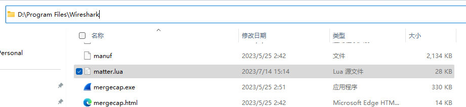
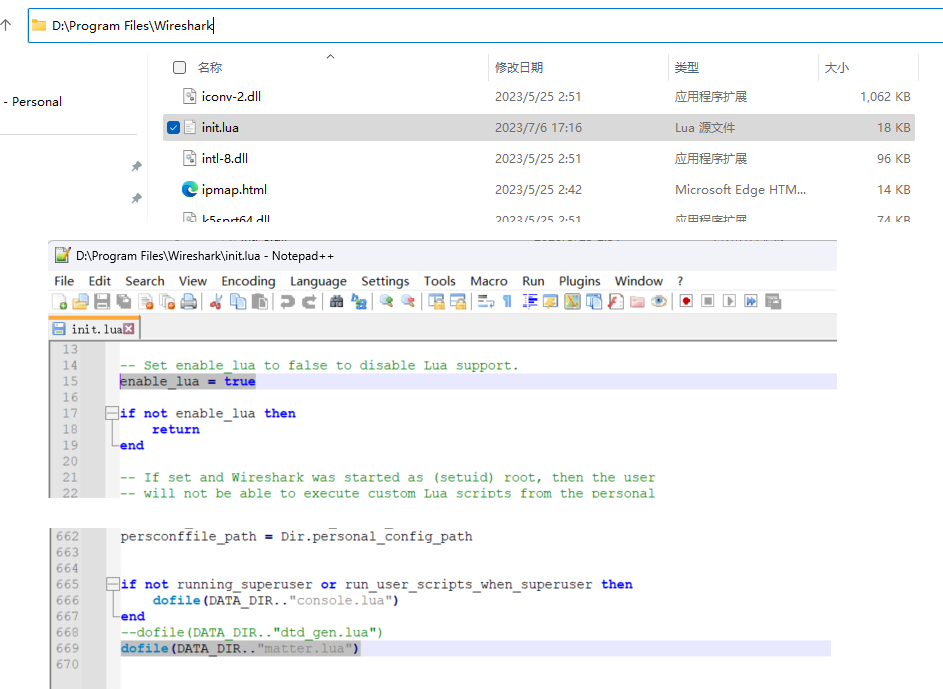
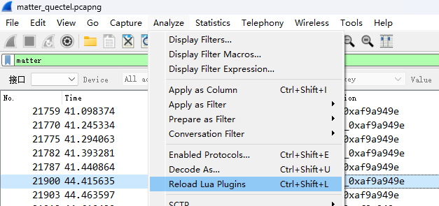
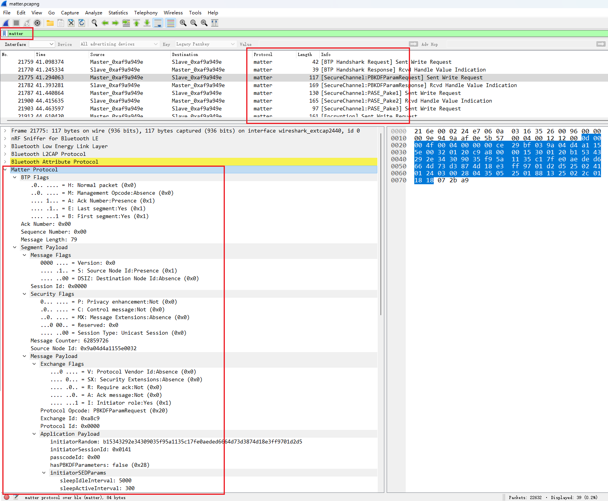

# matter.lua 

## introduction

this lua script used for wireshark to parse matter protocol messages, include BTP,frame,proto headers and payload 

currently, just support ble link plaintext data, need to support wifi link and ciphertext data 

## how to use
### 1. put matter.lua file to wireshark install root directory
 
### 2. open init.lua file in wireshark install root directory, set "enable_lua = true" at begin, and add line "dofile(DATA_DIR.."matter.lua")" in the end

### 3. restart wireshark or menu > Analyze > Reload Lua Plugins, to load matter.lua script 

### 4. example
 

## TODO

### 1. support sub segments
### 2. support parse CASE msg
### 3. support parse encrypt msg
### 4. support parse wifi link msg
